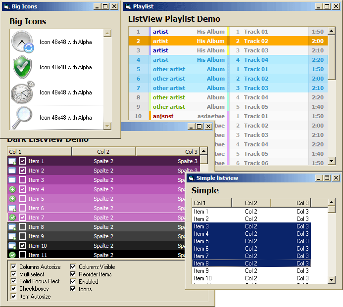

## custom listview

### Description

A list with multiple columns. Multiselect, drag'n'drop item reordering, icons with alpha (LaVolpe's 32bpp dib), checkboxes, simple sorting, own custom styles.
 
### More Info
 

             |
---                |---
**Submitted On**   |2007-03-01 19:15:44
**By**             |[Arne Elster](https://github.com/Planet-Source-Code/PSCIndex/blob/master/ByAuthor/arne-elster.md)
**Level**          |Intermediate
**User Rating**    |5.0 (213 globes from 43 users)
**Compatibility**  |VB 6\.0
**Category**       |[Custom Controls/ Forms/  Menus](https://github.com/Planet-Source-Code/PSCIndex/blob/master/ByCategory/custom-controls-forms-menus__1-4.md)
**World**          |[Visual Basic](https://github.com/Planet-Source-Code/PSCIndex/blob/master/ByWorld/visual-basic.md)
**Archive File**   |[custom\_lis205115322007\.zip](https://github.com/Planet-Source-Code/arne-elster-custom-listview__1-68032/archive/master.zip)

